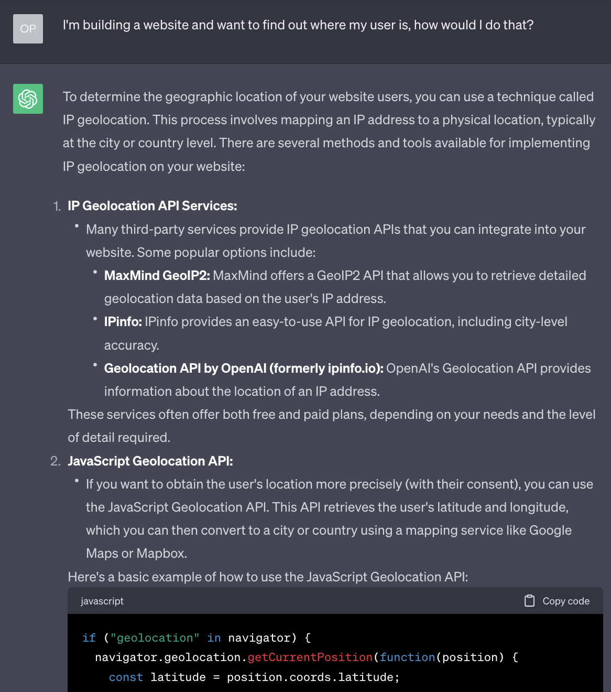

# Geolocation

## Session overview

- What are we building (and why)?
- What information do we need?
- How do we find this information?
- What can we do with it?


## What are we building (and why)?

We want to create a website that can identify where a user is, and then display content appropriate to their current location.

You might have used this functionality yourself in the past, for example when looking for your nearest shop, using a website's store locator.

We'll see a few more examples of what we could do with this information later, there are some interesting and innovative things we could do with it.


## What information do we need?

Now, I could just tell you the answer, but if you'll bear with me for a couple of minutes, we'll figure it out together. It might sound a little convoluted, but I hope that by showing our working it will help to demonstrate how to think like a developer, weighing up options and then selecting the most appropriate solution.

We want to find out where our user is - how do we do it?


### User-generated

Let's start from the simplest option, we could just ask the user to tell us where they are!

Depending on our use-case that could be all we need to do, so don't immediately rule it out just because it seems too easy.

We could put in a simple input text field, and let them tell us.

> Where are you?
>
> <input type="text" />

It might work, but if it's a free-text field, we have no control over what text they might enter.

The answer might be "Brighton", but it might be "At home".

We probably want something more accurate (and reliable!)


### Ordinance Survey

If you're in the UK, you can use an [Ordinance Survey](https://osmaps.com/) grid reference point - it might look something like this:

> TQ 31485 04608

It may be enough for our use-case, but these values are useful only in the UK.


### What 3 words

We could also use [What 3 Words](https://what3words.com/):

> ///fame.handle.serves

There are [issues](https://shkspr.mobi/blog/2019/03/why-bother-with-what-three-words/) with their implementation.

> ///fame.handle.serves - Brighton
>
> ///fame.handle.serve - San Francisco

If we move a small amount we'll get a completely different set of words. And we can't predict what they may be, we need to request them each time. Also, it's a commercial system we might need to pay for.


### Latitude and Longitude

A popular solution for identifying a position anywhere on earth is to use latitude and longitude.

With two simple numeric values we can identify with great accuracy where someone is.

> 50.8228032, -0.1399396

Latitude is the position north to south on the globe, somewhere between the equator and the poles, the value is between -180 and 180.

Longitude is the position east to west, starting from an arbitrary point (Greenwich in east London). Its value is between 0 and 360.

Sounds like the best solution, let's use latitude and longitude for our website.


## How do we find this information?

### Discovery

You can use a search engine, browse Stack Overflow, or ask ChatGPT:

> I'm building a website and want to find out where my user is, how would I do that?

Here's an example of the result when I tried this:



It has given us two options here, a server-side technique and a client-side technique.

Let's look into both.


### Server-side

Many years ago, when I first had to do this for a website, the only way we could do it was a server-side solution similar to that suggested by ChatGPT.

We would have to use a server to identify a user's IP address based on their request.

[https://whatismyipaddress.com/](https://whatismyipaddress.com/)

> 91.125.172.239

We would then use a third-party service which was basically a huge lookup table that would match IP addresses to known locations.

> Exeter, England

But there was a high chance of error, and if you were using a VPN it could be wildly inaccurate.

It was both complicated and potentially inaccurate, and also using a third-party service that incurred a cost.


### Client-side

The second suggestion from ChatGPT is to use the Geolocation API.

It gives a short piece of JavaScript that it says we can use to discover our user's location.

Sounds promising! I'd like to know more about this. Again, we can use a search engine, Stack Overflow, ChatGPT.

When I'm searching for something JavaScript-related, I tend to look on the Mozilla Developer Network (MDN), which usually has reliable and accessible documentation:

- [https://developer.mozilla.org/en-US/docs/Web/API/Geolocation_API](https://developer.mozilla.org/en-US/docs/Web/API/Geolocation_API)
- [https://developer.mozilla.org/en-US/docs/Web/API/Geolocation_API/Using_the_Geolocation_API](https://developer.mozilla.org/en-US/docs/Web/API/Geolocation_API/Using_the_Geolocation_API)


## What can we do with it?

We have finally found how to request our user's location using the Geolocation API, now let's try it!


### Example 1: Retrieving latitude and longitude

We're going to start with a simple example - asking for and retrieving a user's latitude and longitude.

The key point here is that we make a request for a user's position:

```js
navigator.geolocation.getCurrentPosition(successCallback);
```

We pass in the name of a function (in the example above I have called it `successCallback`). This function is called when a position is established.

It is passed a single argument, an object that contains the values we're looking for:

```js
function successCallback(position) {
  const latitude = position.coords.latitude;
  const longitude = position.coords.longitude;
  console.log(latitude, longitude);
}
```

We're not going to do anything special with this information just yet, we'll just display it on the page to test that we can access it.

First, we'll need an HTML file - for the purposes of this tutorial we're assuming a reasonable knowledge of HTML so you can copy and paste this:

```html
<!doctype html>
<html>
  <head>
    <meta charset="utf-8" />
    <title>geolocate</title>
    <link rel="stylesheet" href="style.css" />
    <script defer src="geolocation.js"></script>
    <meta name="viewport" content="width=device-width, initial-scale=1">
  </head>
  <body>
    <h1>geolocate</h1>
    <button class="find-me">Find me!</button>
    <p class="status"></p>
    <p><a class="map-link" target="_blank"></a></p>
  </body>
</html>
```

Also, just to make it look slightly nicer when we test it, I have added a few simple styles:

```css
html {
  background: #efefef;
  height: 100%;
}
body {
  font-family: Georgia, sans-serif;
  line-height: 1.5;
  max-width: 600px;
  min-height: 100%;
  margin: 0 auto;
  padding: 20px;
  background: #fff;
  box-shadow: 0 0 5px 5px rgba(0, 0, 0, 0.2);
}
.status {
  font-size: 20px;
  font-style: italic;
  color: orange;
}
```

Now for the JavaScript:

```js
function geoFindMe() {
  var status = document.querySelector(".status");
  var mapLink = document.querySelector(".map-link");

  mapLink.href = "";
  mapLink.textContent = "";

  function success(position) {
    var latitude = position.coords.latitude;
    var longitude = position.coords.longitude;

    status.textContent = "";
    mapLink.href = `https://www.openstreetmap.org/#map=18/${latitude}/${longitude}`;
    mapLink.textContent = `Latitude: ${latitude}°, Longitude: ${longitude}°`;
  }

  function error() {
    status.textContent = "Unable to retrieve your location";
  }

  if (!navigator.geolocation) {
    status.textContent = "Geolocation is not supported by your browser";
  } else {
    status.textContent = "Locating!";
    navigator.geolocation.getCurrentPosition(success, error);
  }
}

var btn = document.querySelector(".find-me");
btn.addEventListener("click", geoFindMe);
```

Time to try it!

#### Running these examples locally

If you try opening this directly in a browser window, you'll see an error in the console and the Geolocation API won't work as expected:

> _A Geolocation request can only be fulfilled in a secure context._

You either need to run this via a secure web server, or through a local web server _(localhost)_.

One quick way to run locally, open terminal, navigate to the folder and run:

```
python3 -m http.server
```

Then open [http://localhost:8000/](http://localhost:8000/) in a browser window.

Hopefully you'll see your location!

If you get stuck you can find the example files here:

- [HTML](./examples/geolocation/geolocate/index.html)
- [CSS](./examples/geolocation/geolocate/style.css)
- [JS](./examples/geolocation/geolocate/geolocation.js)


### Example 2: Distance between two locations

Now that we know how to access the user's location, we can start to think of uses for it.

The example I gave at the start was for a store locator - discovering the distances between two points.

The name of the calculation required for this is the [Haversine formula](https://en.wikipedia.org/wiki/Haversine_formula).

We can find a JavaScript implementation of this formula [here](https://rosettacode.org/wiki/Haversine_formula#ES5).

This gives us a JavaScript function, `calculateDistance()`, that takes four parameters. We put in a source latitude/longitude and a destination latitude/longitude, and the formula will give us the distance between them (in kilometres).


```js
const distance = calculateDistance(sourceLatitude, sourceLongitude, destinationLatitude, destinationLongitude);
console.log(distance); // 17.412
```


If you get stuck you can find the example files here:

- [HTML](./examples/geolocation/distance/index.html)
- [CSS](./examples/geolocation/distance/style.css)
- [JS](./examples/geolocation/distance/geolocation.js)


### Example 3: Plotting latitude and longitude on a map

We could also plot our user's location on a map.

This example uses [leaflet.js](https://leafletjs.com/) to create a map and drop a pin on our current location.

If you get stuck you can find the example files here:

- [HTML](./examples/geolocation/map/index.html)
- [CSS](./examples/geolocation/map/style.css)
- [JS](./examples/geolocation/map/geolocation.js)


### Further ideas

Here are some ideas of what you could do with this:

- Create an interactive story that only displays the next chapter when a user is within range of a certain destination
- ...


---

## Aside: How does it work?

A quick aside - you may be wondering about how it actually works? How does the browser figure out where a user is?

Well, one of the interesting aspects of this is that we don't _need_ to know. The logic is *'abstracted'* away from us by the browser.

What that means is, the browser does the hard work for us.

If our user is browsing on a mobile device, it _probably_ has GPS built into it, and so the browser can use this.

And as much as I'd like to talk about how GPS works, we don't have 10 weeks. If you'd like to know more, I strongly recommend having a read through [this fantastic website](https://ciechanow.ski/gps/).

If our user is browsing on a laptop or desktop computer, these don't tend to have GPS built in. So how do they work?

Going back to the MDN documentation gives us a hint, and also an important warning:

> **Availability**
>
> As Wi-Fi-based locating is often provided by Google, the vanilla Geolocation API may be unavailable in China. You may use local third-party providers such as Baidu, Autonavi, or Tencent. These services use the user's IP address and/or a local app to provide enhanced positioning.

So, a completely different method of discovery, and one that _may_ be unreliable. This could be important depending on who we are building our website for.


## Aside: Privacy

One last important point, if you have ever used a website that attempts to use the Geolocation API, you may notice that it asks you, the user, whether you're happy to share your location. A website can only locate you provided you explicitly approve them to do so.

This is an important piece of user privacy built into web browsers. Other examples are when you try to access a user's camera or microphone, again this is possible with JavaScript, but only if the user allows access.

(Would you want a website to have access to your camera or microphone without you knowing about it?)

