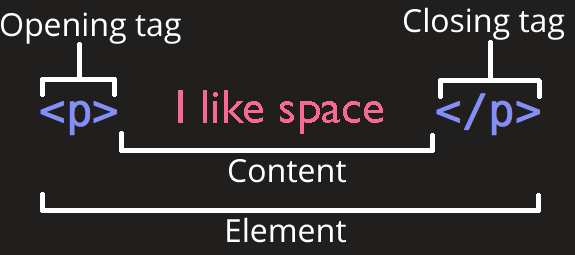
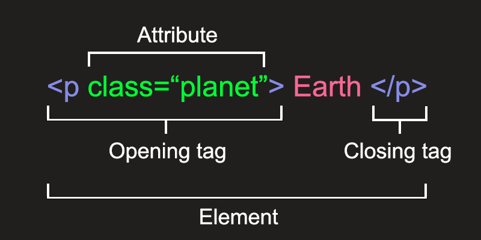

# HTML Refresher

## Introducing HTML

### What is HTML?

**Hyper-Text Markup Language** - or _HTML_ - is a _markup_ language.

HTML is used to give structure to information, such as the content of this page. You can see that it is split up into paragraphs, with several levels of heading.

We "mark up" the text of this page using HTML by identifying the structure of the information.

We use HTML to identify what each piece of text is, for example is it a paragraph or a heading?

The way the text is displayed will vary based on how we structure it.

HTML is a language that can be written in a computer program (or application) called a _plain-text editor_.


### What does HTML look like?

HTML adds structure to information by using `<tags>` (also sometimes called *elements*).

These tags can be identified as words surrounded by `<` and `>`.

If we wanted to turn the following sentence into HTML:

> <p style="font-size: 24px;">I like space</p>

We would write:

```html
<p>I like space</p>
```

In the example above, we have identified the sentence as a _paragraph_ of text.

Here's a guide to the terminology we'll be using to describe this:




### HTML structure

Every HTML web page (or document) has the following structure:

```html
<!doctype html>
<html>
    <head>
        (Information about the page goes here)
    </head>
    <body>
        (Page content goes here)
    </body>
</html>
```

Here's a quick outline of what this means:

- `<!doctype html>` tells the browser that everything that follows is HTML.
- `<html>` (on the second line) is closed with `</html>` (last line). This defines the content of the html document - everything between the two.
- `<head>` (on the third line) is closed with `</head>` on the fifth line. This defines the head of the document, which contains information about the HTML document. Information entered here isn't displayed in the web browser.
- `<body>` is closed with `</body>`. All the information that appears in the web browser goes here.


### HTML rules

Before we start writing our own HTML, there are just a few rules we need to know.

#### Opening and closing tags

Most tags must have matching opening and closing tags

**WRONG**

```html
<p>I live on planet Earth
<p>The best of all the planets
```

**WRONG**

```html
<p>I live on planet Earth</div>
```

**CORRECT**

```html
<p>I live on planet Earth</p>
```

There are some HTML tags that don't have a closing tag - we'll talk about these later:

```html
<br />
<hr />

```

#### Nesting tags

Tags should be properly 'nested', meaning you should close them in the reverse order that you opened them.

**WRONG**

```html
<p>I live on planet <strong>Earth</p>
```

**WRONG**

```html
<p>I <strong>live</p> on planet Earth</strong>
```

**CORRECT**

```html
<p>I live on planet <strong>Earth</strong>.</p>
```

#### Lower-case tags

Tags should match case (just use lower-case for tags)

**WRONG**

```html
<STRONG>I live on planet Earth</STRONG>
```

**WRONG**

```html
<STRONG>I live on planet Earth</strong>
```

**CORRECT**

```html
<strong>I live on planet Earth</strong>
```

Note that the content can have upper-case characters, it's the tags themselves that should be lower-case.


---

## Exercise: Create an HTML web page

Now that we've learned the basics, it's time to put it into practice.

Developers use a 'plain-text editor' program (or application) to create HTML files. One popular editor is [VS Code](https://code.visualstudio.com/).


### Starting from an empty HTML file

Pick somewhere on your computer to store your files.

Once you have a new folder set up, the first thing to do is create an `index.html` file - we'll be adding to this bit by bit.

Start by adding the `<html>`, `<head>` and `<body>` tags, as we saw above:

```html
<!doctype html>
<html>
    <head>

    </head>
    <body>

    </body>
</html>
```

Be ___very___ careful that you add these in the correct order, and that you include the `/` in the closing tags. It needs to look ***exactly*** like the example above.

Note also the first line. It isn't required but it's a good idea to include it anyway. It helps to tell the browser this will be an HTML document.


### Add content to the `<head>`

Next, we'll add some useful information to the `<head>`.

The `<head>` contains information about the page.

We want to tell the browser the title of the page. We do that with the following tag:

```html
<title>Your page title goes here</title>
```

In this case a helpful initial page title would be a description of what we're doing - learning HTML.

The title doesn't appear in the browser window itself but is shown in the tab.

Once you have done this your HTML file should now look like this:

```html
<!doctype html>
<html>
    <head>
        <title>Learning HTML</title>
    </head>
    <body>

    </body>
</html>
```

Again, be ___very___ careful that the opening and closing tags match.


### Add content to the `<body>`

If you were to look at your HTML page in a web browser you wouldn't see anything yet. That's because the `<body>` is still empty.

For now, let's add your name:

```html
<body>
    (Add your name here)
</body>
```

Now your HTML page should look like this (replacing my name with yours!):

```html
<!doctype html>
<html>
    <head>
        <title>Learning HTML</title>
    </head>
    <body>
        (My name)
    </body>
</html>
```


### Opening our page in a web browser

Now we want to preview our HTML page in a web browser.

You can drag the HTML file into a web browser, or double-click it.

Try editing the HTML document - for example try adding more text within the `<body>` tag.

After you have made an update, refresh the page in your browser.


---

## HTML tags and semantics

There are lots of different HTML `<tags>` that we use to mark up information.

Different tags are used for different semantic purposes.

This means that we need to decide whether each piece of information is a heading, a paragraph, a list, etc.

There are a predefined list of available tags - you can't just make up your own.

Here are some of the main HTML tags that you will be using in future.

We will start to use some of these tags shortly.


### Headings

There are several different levels of heading, which are useful for adding structure to a big block of text (such as this page):

```html
<h1>Heading, level 1</h1>

<h2>Heading, level 2</h2>

<h3>Heading, level 3</h3>

<h4>Heading, level 4</h4>
```

This will render as:

> # Heading, level 1
> ## Heading, level 2
> ### Heading, level 3
> #### Heading, level 4


### Paragraphs `<p>`

Most page text should be marked up as paragraphs:

```html
<p>
    This is a paragraph of text
</p>
```

This will render as:

> This is a paragraph of text


### Ordered lists `<ol>`

Numeric lists:

```html
<ol>
    <li>A list...</li>
    <li>... of items...</li>
    <li>...in an ordered list!</li>
</ol>
```

This will render as:

> 1. A list...
> 2. ... of items...
> 3. ...in an ordered list!


### Unordered lists `<ul>`

Bulleted lists:

```html
<ul>
    <li>A list...</li>
    <li>... of items...</li>
    <li>...in an unordered list!</li>
</ul>
```

This will render as:

> - A list...
> - ... of items...
> - ...in an unordered list!


### Emphasis `<em>`

```html
I live on planet <em>Earth</em>.
```

This will render as:

> I live on planet *Earth*


### Strong emphasis `<strong>`

```html
I live on planet <strong>Earth</strong>.
```

This will render as:

> I live on planet **Earth**


### Closing tags

Remember, you must ensure that you close the tags in the order that you open them.

The tags above need to be closed. This is done with the `/` symbol as you can see above.

```html
<p>...</p>
```


### Self-closing tags

Some tags don’t need to be closed, such as:

 - `<br />`, which adds a line-break
 - `<hr />` which adds a horizontal rule
 - `` which adds an image (more on this later)

In such cases, the `/` symbol at the end of the tag is optional - they can be written as:

 - `<br>`
 - `<br/>`
 - `<br />`

---


## Exercise: Use semantic elements in an HTML web page

Back to our project.

This first page is going to become our 'home page', so let's set up a structure that we can extend later.

Here are a few tasks to complete. After each one, check the output in the browser to make sure it looks how you intended. If it doesn't look carefully at what you have entered to make sure you haven't entered anything incorrectly.

1. Add `<h1>` tags around your name:

  ```html
  <h1>(My name)</h1>
  ```

2. Add a paragraph below this, perhaps something along the lines of "welcome to my website" (you may be able to think of something better to write - and this can be changed as often as you like as we progress):

  ```html
  <p>Welcome to my website!</p>
  ```

3. Add `<h2>` tags for a subheading with the title "HTML exercises":

  ```html
  <h2>HTML exercises</h2>
  ```

4. Under this, add an unordered list with the following content - these are the pages we're going to create. (We'll learn how to make these into links later).

    ```html
    <ul>
        <li>
            Images
        </li>
        <li>
            Earth
        </li>
        <li>
            Recipe
        </li>
        <li>
            Dictionary
        </li>
    </ul>
    ```

When you have completed all of the steps above, your HTML home page should now look like this:

```html
<!doctype html>
<html>
    <head>
        <title>Learning HTML</title>
    </head>
    <body>
        <h1>(My name)</h1>
        <p>Welcome to my website!</p>

        <h2>HTML exercises</h2>
        <ul>
            <li>
                Images
            </li>
            <li>
                Earth
            </li>
            <li>
                Recipe
            </li>
            <li>
                Dictionary
            </li>
        </ul>
    </body>
</html>
```

Check very closely to make sure it looks exactly like this, for example that every tag is opened and closed correctly, and all the closing tags have a `/` in them.

---


## Attributes

So far, we have learned about some common HTML elements - `<h1>`, `<p>`, `<li>`, etc.

Sometimes, when we create a new element, we also need to supply some extra information so that the browser knows what we want to do.

For example:

- We might want to add some 'meta' information about the page
- We might want to add an image, in which we case we need to tell the browser what the image is
- We might want to add a link, in which case we need to tell the browser what the URL is
- We might want to style just one paragraph element in the page, rather than all of them

We'll go through these situations to explain how you would achieve them.

For each situation, the way in which we supply this extra information to the browser is by adding an **attribute** to the HTML element.

This is what an attribute looks like:




### HTML attribute rules

The attribute is added *within* the opening HTML tag.

Note the spacing, there is a space after the tag name (in this example `p`), and then no spaces between the attribute name (in this example `class`), the equals sign, or the opening/closing quotes.

**WRONG**

```html
<p class = "planet">Earth</p>
```

**CORRECT**

```html
<p class="planet">Earth</p>
```

We'll now see some examples of different HTML attributes.

---


## Links

One of the most powerful traits of the web is the ability to move between different pages.

We do this by adding _links_ into our HTML.

Links in HTML are identified using the `<a>` element, which stands for _anchor_.

Here's an example:

```html
A <a>link to the Earth</a> on wikipedia
```

And here's how that might render in a web browser:

> A [link to the Earth](#) on Wikipedia

We have 'marked up' a piece of text as a link.

But if you try the link above... nothing happens. That's because we haven't told the browser what we want the link to do when it is clicked.

To specify the URL that the browser should redirect to another page when the link is clicked, we need to add an attribute that contains the relevant URL.

The attribute is called `href`, and looks like this:

```html
A <a href="https://en.wikipedia.org/wiki/Earth">link to the Earth</a> on wikipedia
```

> A [link to the Earth](https://en.wikipedia.org/wiki/Earth) on Wikipedia

It should now work as expected!

We'll add some links to our website shortly.


You can read more about using links here:

 - [https://developer.mozilla.org/en-US/docs/Learn/HTML/Introduction\_to\_HTML/Creating_hyperlinks](https://developer.mozilla.org/en-US/docs/Learn/HTML/Introduction_to_HTML/Creating_hyperlinks)

---


## Images

Images are added to an HTML page using an `` element:

```html

```

### _src_ attribute

As with `<a>` links, an attribute is used to specify where the picture is - this attribute is called `src` (which stands for 'source').

```html

```

For this to work, the web browser needs to be able to find the image that is referenced by the attribute, in this case `earth.jpg`.

We can either save a copy of the image somewhere ourselves, or we can use an image from elsewhere on the internet. We'll see examples of both shortly.


### _alt_ attribute

You should always add an `alt` attribute to an image. This indicates the alternative text to use in case it is not possible to load the image, for example if the link no longer works.

It will also help people who are visually impaired and using screen-readers that read web pages out to them or convert them to braile, because this is the text that will be used:

```html

```

You can read more about using images here:

- [https://developer.mozilla.org/en-US/docs/Learn/HTML/Multimedia\_and\_embedding/Images\_in\_HTML](https://developer.mozilla.org/en-US/docs/Learn/HTML/Multimedia_and_embedding/Images_in_HTML)


---

## Exercise - Adding links and images

We're going to create a new page called `images.html`, so let's start by adding a link to this new page from your home page.

You already have the following HTML in your `index.html` home page:

```html
<li>
    Images
</li>
```

We first need to add a link around the text, so it looks like this:

```html
<li>
    <a href="./images.html">Images</a>
</li>
```

Look very carefully at the HTML link you have added, make sure it matches the example above exactly.

Now we need to create our new file `images.html` file.

Next, add the following HTML content into this new file:

```html
<!doctype html>
<html>
    <head>
        <title>
            Images
        </title>
    </head>
    <body>
        <p><a href="./">Back to home</a></p>
        <h1>Images</h1>


    </body>
</html>
```

### Using an image from another server

Let's start by adding an image from Wikipedia. Here's the URL of the image:

[https://upload.wikimedia.org/wikipedia/commons/9/97/The\_Earth\_seen\_from\_Apollo\_17.jpg](https://upload.wikimedia.org/wikipedia/commons/9/97/The_Earth_seen_from_Apollo_17.jpg)

If we want to add that into our page, we make that the `src` of an `img` element:

```html

```

Add this image in below the `<h1>` element in the HTML page, and refresh your browser to see if it appears.

You may notice that the image is huge. Don't worry, we'll learn how to fix that when we learn CSS.


### Using an image on our server

It can be useful to embed images hosted elsewhere as we have just done, but there are also dangers.

We don't have any control over the image, and so we can't guarantee that it won't be removed or changed.

It is usually best, when possible, to host our images ourselves, alongside our HTML pages.

You can use the same picture of earth that we used above, or you can find another image.

Create a folder called `images` and put the file in there.

The code would be:

```html

```

If you get stuck, take a look at the following example:

- [Images](./examples/images.html)


---

## Exercise - Putting it all together

Let's practice everything we've learned so far

1. Create a new page called `earth.html`

2. Add a link to this page from your `index.html` home page.

   ```html
   <li>
        <a href="./earth.html">Earth</a>
    </li>
   ```

3. In `earth.html`, start with the basic HTML page structure we've used for previous exercises:

    ```html
    <!doctype html>
    <html>
        <head>

        </head>
        <body>

        </body>
    </html>
    ```

4. Add a `<title>` element with a value of "Earth" to the `<head>`

5. Add a link back to the home page to the `<body>`:

    ```html
    <a href="./">Back to home</a>
    ```

6. Below the link you just added, copy and paste the following text:

    ```html
    I live on planet Earth
    There are many reasons why Earth is my favourite planet:
    Beautiful sunsets
    Rainforests   and coral reefs
    I get to build
    websites
    ```

7. Look at this page in your browser.

    Note that the text is rendered without any formatting or layout, and also that line breaks in a HTML file are not rendered as line breaks in the browser, and multiple consecutive spaces are rendered as a single space.

8. We're going to format this text using the tags we looked at earlier.

    Start with:

    ```html
    <h1>I live on planet Earth</h1>
    ```

9. If you look at the page in the browser again you should see that it now renders this text using the style associated to a top level heading - big bold text.

    This is a good habit to get into, making a small change and then checking to see if it looks how you expected it to look.

10. Now, specify that the first sentence is a paragraph using `<p>`:

    ```html
    <p>There are many reasons why Earth is my favourite planet:</p>
    ```

11. Change the style of some individual words using `<em>` and `<strong>`:

    ```html
    <p>There are <em>many</em> reasons why Earth is my
    <strong>favourite</strong> planet:</p>
    ```

12. In the same paragraph, add a link to the word Earth:

    ```html
    <a href="https://en.wikipedia.org/wiki/Earth">Earth</a>
    ```

13. The remaining text is supposed to be displayed as a list. A bulleted list is specified using `<ul>` and list items are specified using `<li>`:

    ```html
    <ul>
        <li>Beautiful sunsets</li>
        <li>Rainforests and coral reefs</li>
        <li>I get to build websites</li>
    </ul>
    ```

    Note the updated formatting - the text has re-indented.

14. Add an image:

    ```html
    
    ```

### Result

When you look at the page in a web browser the formatting should look something like this:

> # I live on planet Earth
>
> There are *many* reasons why [Earth](https://en.wikipedia.org/wiki/Earth) is my **favourite** planet:
>
> - Beautiful sunsets
> - Rainforests and coral reefs
> - I get to build websites

It is important to get some good habits when writing HTML.

The first one is to make the HTML human-readable using indentation and line breaks.

For example, you code should now look like this:

```html
<!doctype html>
<html>
    <head>
        <title>
            Earth
        </title>
    </head>
    <body>
        <p><a href="./">Back to the home page</a></p>

        <h1>I live on planet Earth</h1>

        <p>
            There are <em>many</em> reasons why <a href="https://en.wikipedia.org/wiki/Earth">Earth</a> is my <strong>favourite</strong> planet:
        </p>

        <ul>
            <li>Beautiful sunsets</li>
            <li>Rainforests and coral reefs</li>
            <li>I get to build websites</li>
        </ul>

        
    </body>
</html>
```

This code should be easy to read and finding errors such as missing closing elements is made much easier.

When you have finished, your website should look like this: [earth.html](./examples/earth.html)


---

## Internal links

It is also possible to link to a specific part of a page.

We can link to an anchor within the current page, or to an anchor within another page.

To create the anchor, we need to add an `id` attribute in our HTML:

```html
<h3 id="map">Map</h3>
```

The example above has an `id` attribute of `map`, but it can be almost anything, provided you follow two key rules:

1. The `id` **must** be unique in the page, so you can't have two identical `id` attributes in the same page.

2. The `id` can't contain any spaces (you can use hyphens instead).

To add a link to this anchor, we use the `#` symbol followed by the value of the `id` attribute. The exact content of the link will depend on whether we're linking from within the same page or from another page.

If we are linking to an anchor within the same page we just reference the `id`:

```html
<a href="#map">Jump to the map section</a>
```

If we are linking to an anchor from another page we need to reference the file name followed by the `id`:

```html
<a href="another-page.html#map">Jump to the map section of another page</a>
```


## Block and inline elements

Some HTML elements are considered 'block' elements, while others are considered 'inline' elements.

It's important to understand the difference between the two.


### Block Elements

Most of the elements we have just heard about are 'block' elements:

- `<h1>` - `<h6>`
- `<p>`
- `<ul>`
- `<ol>`
- `<li>`
- `<hr />`


There are a few key characteristics of block elements:

- They sit on their own line
- They fill 100% of the page width


### Inline elements

Other elements that we have just heard about are 'inline':

- `<em>`
- `<strong>`

These elements sit next to one another on the same line.

You don't use inline elements on their own, you use inline elements _within_ block elements.


---

## Comments

Sometimes it's handy to add a comment into your code.

This isn't something that the browser uses to render the page, but it can be a helpful note for yourself, or to help you to structure the page.

HTML comments start with `<!--` and end with `-->`

```html

<!doctype html>
<html>
    <head>
        <title>Learning HTML</title>
    </head>
    <body>
        <!--
            This is an example of a comment.
            It's ignored by the browser, but may be useful to us!
        -->
    </body>
</html>
```

---

## `<meta>` elements

We've seen that we add information into the `<head>` of an HTML page when we want to tell the browser some information _about_ the page, but we don't want this information displayed in the browser window itself.

We call this type of data 'meta' information.

The example we saw earlier was for adding a `<title>` element, which controls the text that is displayed in the browser tab.

Other types of meta information are often (but not always) added by attributes added to a `<meta>` tag.

You can read more about the `<meta>` element here:

 - [https://developer.mozilla.org/en-US/docs/Web/HTML/Element/meta](https://developer.mozilla.org/en-US/docs/Web/HTML/Element/meta)


### Character set (`charset`)

The first `<meta>` element we'll start adding to our HTML pages helps the browser to identify what _character set_ we want to use.

If we don't add this, then characters that look fine in our code editor might not render correctly in our browser.

That's because many browsers default to being able to render only a limited set of the Latin alphabet.

From now on, for every HTML page that we create, we want to tell the browser what character set we'll be using.

We can do that by adding the following element into the `<head>` of our HTML page:

```html
<meta charset="utf-8" />
```

By stating that the character set is `utf-8`, we tell the browser to expect that there may be characters that aren't in the Latin alphabet.

`utf-8` is a 'universal' character set that includes almost every character from any human language, so we can set this and then assume that the browser can display characters from virtually any language.

For example, the `<head>` of our home page should now look like this:

```html
<head>
    <title>Learning HTML</title>
    <meta charset="utf-8" />
</head>
```


### Other `<meta>` attributes

Other examples of `<meta>` attributes include `name` and `content`. These are useful for adding page descriptions, which are often used by search engines:

```html
<meta name="description" content="The best website about space!" />
```

There are also several 'open graph' attributes that can be used to add images and descriptions when you post the URL in certain social media sites. You can find out more about these attributes here:

- [https://ogp.me/](https://ogp.me/)

Try adding some of these extra meta tags into the `<head>` to your pages, such as `og:title`, `og:image` and `og:url`.

---

## File paths

When we use links, we need to make sure we know where the HTML page is located.


### Absolute paths

If the HTML page is stored on another server, we need to state its full URL, which is known as an _absolute_ path.

```html
<a href="https://en.wikipedia.org/wiki/Earth">Earth</a>
```

### Relative paths

#### Files in the same folder

If the HTML page is in the same folder as the current HTML file, we can just reference the file name.

```html
<a href="earth.html">Earth</a>
```

#### Files in a sub folder

If the page is in a sub folder, we need to specify the path to the file, relative to the current HTML file.

So we need to reference the folder name first, followed by a slash, and then the name of the file.

```html
<a href="./exercises/earth.html">Earth</a>
```

#### Files in a parent folder

If the page is in the folder above, again we need to specify the path to the file, relative to the current HTML file.

To move up a folder, we need to add `..`, followed by a slash, and then the name of the file.

```html
<a href="../earth.html">Earth</a>
```

#### Combining paths

Sometimes we need to combine these, such as moving up a folder, and then down into a different sub-folder:

```html
<a href="../exercises/earth.html">Earth</a>
```

#### `index.html`

If you are adding a link to an HTML page, and that file is called `index.html`, you don't need to add this to the URL.

This can be a good way to keep URLs looking 'clean' as you can just link to the folder name and not to any files.

```html
<a href="../">Back to home</a>
```

Rather than:

```html
<a href="../index.html">Back to home</a>
```

---

## Tables

Tables are handy for displaying structured data.

There are a number of table-related tags to use for constructing a table.


### Table HTML

Here is an example table, using many of these tags:

```html
<table>
    <thead>
        <tr>
            <th>Column 1 title</th>
            <th>Column 2 title</th>
        </tr>
    </thead>
    <tbody>
        <tr>
            <td>Row 1 Cell 1</td>
            <td>Row 1 Cell 2</td>
        </tr>
        <tr>
            <td>Row 2 Cell 1</td>
            <td>Row 2 Cell 2</td>
        </tr>
    </tbody>
</table>
```

And the result:

>
> <table>
>  <thead>
>    <tr>
>      <th>Column 1 title</th>
>      <th>Column 2 title</th>
>    </tr>
>  </thead>
>  <tbody>
>    <tr>
>      <td>Row 1 Cell 1</td>
>      <td>Row 1 Cell 2</td>
>    </tr>
>    <tr>
>      <td>Row 2 Cell 1</td>
>      <td>Row 2 Cell 2</td>
>    </tr>
>  </tbody>
> </table>

A brief explanation of the above:

 - Tables are surrounded with a `<table>…​</table>` element.
 - The head of the table is surrounded by a `<thead>…</thead>` element
 - Each table row is surrounded by a `<tr>…</tr>` element
 - Cells inside a row are defined with the `<td>…</td>` element
 - The first row (heading) can optionally be identified with `<th>…​</th>`

---

## Further practice

Now that we have learned the fundamentals of HTML, we're going to practice by creating a couple of example pages.


### Creating a 'recipe' HTML page

This will help us to learn about the best way to structure our content.

For these two exercises, there isn't a single 'correct' way to do it, you have a choice of the HTML elements demonstrated above - headings, paragraphs, lists etc.

You need to select what you think would be the most appropriate (or 'semantic') element for each piece of content.


#### Recipe

Here's the content that we'll be turning into HTML:

> Lemon cake recipe
>
> Ingredients:
>
> Cake ingredients:
>
> 100ml vegetable oil, plus extra for the tin
>
> 275g self-raising flour
>
> 200g golden caster sugar
>
> 1 tsp baking powder
>
> 1 lemon, zested, 1/2 juiced
>
> Icing ingredients:
>
> 150g icing sugar
>
> 1/2 lemon, juiced
>
>
> Method
>
> Step 1
>
> Heat oven to 200C/180C fan/gas 6. Oil a 1lb loaf tin and line it with baking parchment. Mix the flour, sugar, baking powder and lemon zest in a bowl. Add the oil, lemon juice and 170ml cold water, then mix until smooth.
>
> Step 2
>
> Pour the mixture into the tin. Bake for 30 mins or until a skewer comes out clean. Cool in the tin for 10 mins, then remove and transfer the cake to a wire rack to cool fully.
>
> Step 3
>
> For the icing, sieve the icing sugar into a bowl. Mix in just enough lemon juice to make an icing thick enough to pour over the loaf (if you make the icing too thin, it will just run off the cake).
>
> (recipe from: [https://www.bbcgoodfood.com/recipes/vegan-lemon-cake](https://www.bbcgoodfood.com/recipes/vegan-lemon-cake))


#### Creating our recipe page

We'll start by creating a new HTML page for a recipe.

Create a new file, call it ***recipe.html***

> **Important!** Make sure there are no capital letters or spaces in the file name

Start with the same basic HTML structure that we used for our first page:

```html
<!doctype html>
<html>
    <head>

    </head>
    <body>

    </body>
</html>
```

First, add a `<title>` element into the `<head>` element, something that you think would be an appropriate description of the page, for example the first line of our recipe:

```html
<title>Lemon cake recipe</title>
```

Next, we can start adding content into the `<body>` element.

We should always start with an `<h1>` element, which will contain the most important content on the page, the main page title.

In this case it's probably the same as the page title (but it doesn't always need to be the same):

```html
<h1>Lemon cake recipe</h1>
```

At this point your HTML should look like this:

```html
<!doctype html>
<html>
    <head>
        <title>Lemon cake recipe</title>
    </head>
    <body>
        <h1>Lemon cake recipe</h1>


    </body>
</html>
```

Look very closely at the code above, and make sure it matches exactly what you have entered.


#### Previewing our page

Now let's get your page open in a browser window so we can see our results.

Open your home page in a new browser window, and click the link of the page you just created: `recipe.html`.


#### Adding the rest of our content

Once we have the page open, we can switch back to our code and add the rest of our content.

To save time you can copy and paste the text from the block above.

Then, for each piece of text, think about what HTML element would make most sense, for example should it be an `<h2>`, and `<h3>`, a `<p>`, or an ordered or unordered list item? Could you use `<strong>` or `<em>` anywhere?

Keep refreshing the browser window as you progress to ensure that the code you enter is having the expected effect.

If you get stuck, here is an example answer that you can look at:

 - [HTML](./examples/recipe.html)

Don't forget this isn't the _correct_ answer, it's just one interpretation of how it could be done.


---

### Creating a 'dictionary' HTML page

We're going to create another example HTML page, this time we'll be creating a page that contains a dictionary definition.

As before, there are no right or wrong answers, but it's good practice to think about the available HTML elements to consider which one might be most appropriate - which one might be semantically correct.


#### Definition

Here's the content that we will be turning into a page:

> Galaxy
>
> (noun)
>
> Pronunciation: gæləksi / ɡæl.ək.si
>
> Plural: galaxies
>
> Definitions
>
> 1.
>
> A galaxy is an extremely large group of stars and planets that extends over many billions of light years.
>
> Example usage: Astronomers have discovered a distant galaxy.
>
> Synonyms: star system, solar system, nebula
>
> 2.
>
> The Galaxy is the extremely large group of stars and planets to which the Earth and the Solar System belong.
>
> Example usage: The Galaxy consists of over 100 billion stars.
>


#### Creating our dictionary page

We'll follow similar steps, so start by creating a new file called `dictionary.html`

We can add our initial page structure:

```html
<!doctype html>
<html>
    <head>

    </head>
    <body>

    </body>
</html>
```

Then we can add our `<title>` element into the `<head>` element:

```html
<title>Galaxy - dictionary definition</title>
```

Next, we can add our `<h1>` element into the `<body>`:

```html
<h1>Galaxy</h1>
```

At this point your HTML should look like this:

```html
<!doctype html>
<html>
    <head>
        <title>Galaxy - dictionary definition</title>
    </head>
    <body>
        <h1>Galaxy</h1>


    </body>
</html>
```

Get this open in a browser window so that we can test our code as we go.


#### Adding the rest of our content

Work through the rest of the contnt, adding it into the page. Preview your changes frequently to ensure it looks as you expect.

If you get stuck, here is an example answer that you can look at:

 - [HTML](./examples/dictionary.html)

And again, this isn't the _correct_ answer, it's just one interpretation of how it could be done.


### Linking our pages together

We are going to add some links between the pages we've been creating so that we can easily navigate between our pages.


### Linking to the new files

1. Currently in our home page (`index.html`) we have these elements:

```html
<li>
    Recipe
</li>
<li>
    Dictionary
</li>
```


We should make these into links, so add some `<a>` elements so that your HTML looks like this:

```html
<li>
    <a href="./recipe.html">Recipe</a>
</li>
<li>
    <a href="./dictionary.html">Dictionary</a>
</li>
```

___VERY IMPORTANT!___ - Make sure the text you enter for the `href` attribute is all lower case, and no spaces in the name.

Open your home page in a web browser. Can you now click through to the pages you created?


### Linking back to the home page

We can now link to all of our exercises, but we haven't currently linked back to the home page once you visit any of these exercise HTML pages.

On each page, you could add the following, either into the top or bottom of the `<body>` element:

```html
<p>
    <a href="./">Return to the home page</a>
</p>
```

Try this in your browser. Can you now navigate between all of your pages?

